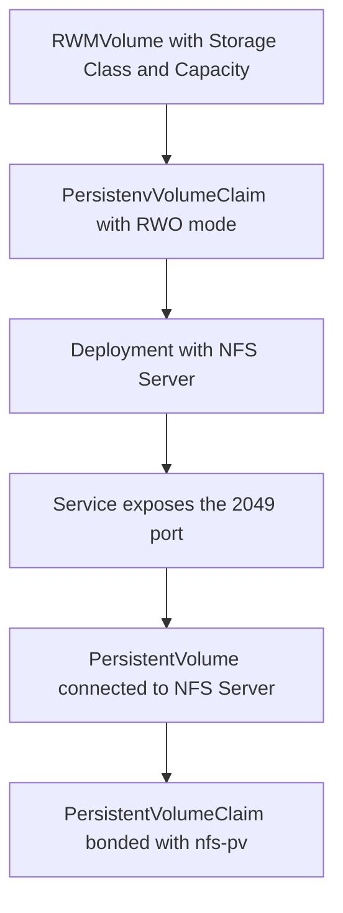

# How RWMVolume Operator works

The operator watches `RWMVolume` [custom resource](https://kubernetes.io/docs/concepts/extend-kubernetes/api-extension/custom-resources/).

## Custom Resource Definitions

```YAML
apiVersion: dganochenko.work/v1alpha1
kind: RWMVolume
metadata:
  name: resourcename
spec:
  # StorageClass of the main Volume
  # You can use standrd in GKE or gp2 in EKS, for example
  storageClassName: standard
  # Volume size in gigabytes
  # Should be a number
  capacity: 2
```

When a `RWMVolume` resource is created in Kubernetes, the operator creates the volume with chosen capacity.  
Afterwards, it creates a `Deployment` with NFS Server to share the data, a `Service` exposes the NFS port and a `PV`\\`PVC` pair, which can be used by other pods. 

## Workflow details



## [Performance](#performance)

Let's create a volume with 100 Gb size.

```bash
cat <<EOF|kubectl apply -f -
---
apiVersion: dganochenko.work/v1alpha1
kind: RWMVolume
metadata:
  name: fio-vol
spec:
  storageClassName: standard
  capacity: 100
---
apiVersion: v1
kind: PersistentVolumeClaim
metadata:
  name: fio2-vol-volume-pvc
spec:
  accessModes:
  - ReadWriteOnce
  resources:
    requests:
      storage: 100Gi
  storageClassName: standard
EOF
```

We can see 2 PVCs are available now, common and nfs-based:

```console
$ kubectl get pvc
NAME                  STATUS        VOLUME                                     CAPACITY   ACCESS MODES   STORAGECLASS   AGE
fio-vol-nfs-pvc       Bound         fio-vol-default-nfs-pv                     100Gi      RWX                           23s
fio-vol-volume-pvc    Bound         pvc-66d4ea48-67aa-4381-a570-6bb0a18ed67b   100Gi      RWO            standard       23s
fio2-vol-volume-pvc   Bound         pvc-e973e492-6acb-4204-aa97-cb267c9dbf4f   100Gi      RWO            standard       23s
```

Next we will run 2 [kbench](https://github.com/yasker/kbench) jobs and compare the performance of directly connected 100Gb strorage and through the NFS. 

Scores of directly connected PVC (IOPS and Bandwidth - higher is better, Latency - lower is better):

```console
$ kubectl logs -f benchorig-n2jbp
TEST_FILE: /volume/test
TEST_OUTPUT_PREFIX: test_device
TEST_SIZE: 10G
Benchmarking iops.fio into test_device-iops.json
Benchmarking bandwidth.fio into test_device-bandwidth.json
Benchmarking latency.fio into test_device-latency.json

=========================
FIO Benchmark Summary
For: test_device
CPU Idleness Profiling: disabled
Size: 10G
Quick Mode: disabled
=========================
IOPS (Read/Write)
        Random:                120 / 243
    Sequential:          12,326 / 14,952

Bandwidth in KiB/sec (Read/Write)
        Random:          13,162 / 23,742
    Sequential:         98,280 / 122,867
                                        

Latency in ns (Read/Write)
        Random:   19,736,002 / 3,324,931
    Sequential:         85,123 / 732,332
```

And through the nfs:

```console
$ kubectl logs -f benchnfs-6w45p
TEST_FILE: /volume/test
TEST_OUTPUT_PREFIX: test_device
TEST_SIZE: 10G
Benchmarking iops.fio into test_device-iops.json
Benchmarking bandwidth.fio into test_device-bandwidth.json
Benchmarking latency.fio into test_device-latency.json

=========================
FIO Benchmark Summary
For: test_device
CPU Idleness Profiling: disabled
Size: 10G
Quick Mode: disabled
=========================
IOPS (Read/Write)
        Random:                121 / 250
    Sequential:          11,947 / 14,953

Bandwidth in KiB/sec (Read/Write)
        Random:          13,988 / 24,846
    Sequential:        102,943 / 122,822
                                        

Latency in ns (Read/Write)
        Random:   21,247,141 / 3,321,962
    Sequential:        123,412 / 814,006
```
