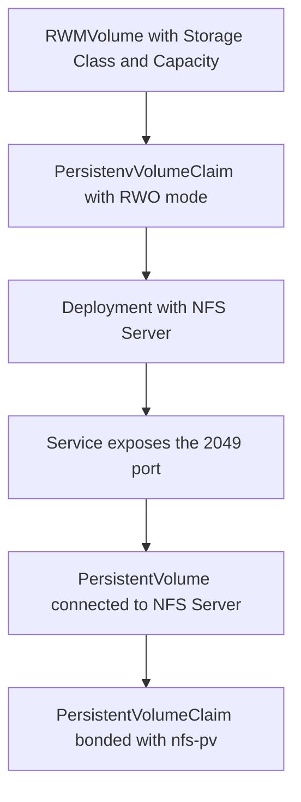

# How RWMVolume Operator works

The operator watches `RWMVolume` [custom resource](https://kubernetes.io/docs/concepts/extend-kubernetes/api-extension/custom-resources/).

## Custom Resource Definitions

```YAML
apiVersion: dganochenko.work/v1alpha1
kind: RWMVolume
metadata:
  name: resourcename
spec:
  # StorageClass of the main Volume
  # You can use standrd in GKE or gp2 in EKS, for example
  storageClassName: standard
  # Volume size in gigabytes
  # Should be a number
  capacity: 2
```

When a `RWMVolume` resource is created in Kubernetes, the operator creates the volume with chosen capacity.  
Afterwards, it creates a `Deployment` with NFS Server to share the data, a `Service` exposes the NFS port and a `PV`\\`PVC` pair, which can be used by other pods. 

## Workflow details



